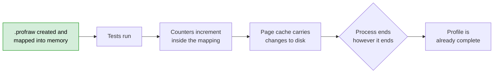
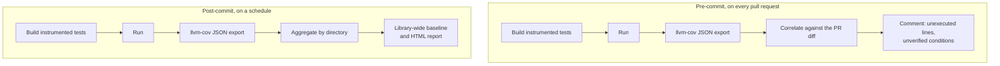

# Code coverage for LLVM libc

> **The short version.** LLVM libc's tests link against nothing but the library
> under test. That is what makes them trustworthy, and it is also why no
> standard coverage tool could run on them: the profiling runtime needs a
> hosted C library to write its output, and there isn't one. This work makes
> statement, branch and MC/DC coverage possible on those tests anyway, in a way
> the project has now merged and documented.

Everything linked here is upstream in `llvm/llvm-project`. No code is copied
into this repository. If you have two minutes, read the table and the two
diagrams. If you have ten, read the whole thing.

## At a glance

| Link | What it is |
|---|---|
| [RFC: Enabling code coverage in LLVM libc](https://discourse.llvm.org/t/rfc-libc-enabling-code-coverage-in-llvm-libc/91355) | Problem statement and proposed approach |
| [#213271](https://github.com/llvm/llvm-project/pull/213271) | Coverage instrumentation for freestanding tests. **Merged** |
| [#214692](https://github.com/llvm/llvm-project/pull/214692) | Developer guide for running coverage locally. **Merged** |
| [#220595](https://github.com/llvm/llvm-project/pull/220595) | `getpid` syscall wrapper, split out on review. **Merged** |
| [#221802](https://github.com/llvm/llvm-project/pull/221802) | Full-build support and the MC/DC option. **Merged** |
| [RFC: Automated code coverage infrastructure](https://discourse.llvm.org/t/rfc-libc-automated-code-coverage-infrastructure-and-ci-workflows/91534) | Follow-up proposal for reporting it automatically |
| [#219165](https://github.com/llvm/llvm-project/pull/219165) | CI workflows and coverage analysis tooling. **In review** |
| [#222708](https://github.com/llvm/llvm-project/issues/222708) | Errno ABI issue surfaced by the above. Open |

To try it, configure a full build with `-DLIBC_ENABLE_COVERAGE=ON`, and add
`-DLIBC_ENABLE_COVERAGE_MCDC=ON` for MC/DC. The full walkthrough lives in tree
at `libc/docs/dev/code_coverage.md`.

## Why coverage matters here

A passing test suite tells you the code you tested works. It says nothing about
the code you didn't.

Coverage instrumentation closes that gap. It records which lines actually ran
and which branches were actually taken while the tests executed, so that "we
have 4,000 tests" becomes the far more useful "this error path has never once
been executed."

For a C standard library the stakes are unusually high. Almost everything on the
system sits on top of it. A mishandled edge case in `strtol` or an untaken
branch in `memcpy` is not one library's bug, it is a bug inherited by every
program that links against it. And these are exactly the functions with dense
input validation and rarely-hit failure paths, which is where a test suite is
most likely to leave gaps without anyone noticing.

Before this work, LLVM libc had no way to see any of that.

## Why it was hard

**Hermetic tests.** LLVM libc *is* a C library, which makes testing it awkward.
If a test binary also links the system's C library, two complete implementations
of the same symbols are in the binary at once, and it is hard to be sure which
one a given call reached. So LLVM libc compiles and links its tests with
`-nostdlib`. Nothing from the host is present, and the harness supplies the few
primitives it needs itself. This is what makes the suite trustworthy, and it is
not negotiable.

**Instrumentation assumes the opposite.** When Clang instruments a binary with
`-fprofile-instr-generate`, it links in compiler-rt's profiling runtime. That
runtime counts executions in memory and writes them out when the program exits,
using `fopen`, `fwrite`, `malloc` and `atexit` to do so. In a freestanding build
none of those exist. The binary faithfully counts everything, then writes
nothing.

*Standard profiling. The highlighted step needs a hosted C library. In a
`-nostdlib` build it does not exist, so nothing after it happens.*

**Death tests.** Some libc tests deliberately crash a forked subprocess and
assert on how the child died. Anything that dumps coverage at normal exit
records nothing for these, and anything that intercepts the crash to dump first
risks changing the exit status the parent asserts on.

All three problems were written up and discussed with the community before any
implementation was proposed:
[RFC: Enabling code coverage in LLVM libc](https://discourse.llvm.org/t/rfc-libc-enabling-code-coverage-in-llvm-libc/91355).

## What was built

### 1. Coverage instrumentation for freestanding tests

[#213271](https://github.com/llvm/llvm-project/pull/213271), merged.

The merged implementation uses Clang's continuous instrumentation profiling mode
(`-fprofile-continuous`, alongside `-fprofile-instr-generate` and
`-fcoverage-mapping`). The idea is a neat inversion of the standard flow.

*Continuous profiling. The file exists before the first line of test code runs.
There is nothing left to do at exit, so it does not matter how exit happens.*

Instead of counting in memory and writing at the end, the profile file is
created and mapped *before* the program starts, and the counters live directly
inside that mapping. Every increment is already in the file. The OS page cache
carries it to disk as execution proceeds.

That inversion is what makes it work here:

- There is no dump routine, so nothing needs `fopen` or `malloc`.
- There is no `atexit` hook, so a process killed by a signal still leaves a
  complete profile behind. The death test problem disappears without touching
  signal handling or altering the status the parent observes.

The feature is off unless enabled at configure time. Because the options are
Clang-specific, enabling coverage under another compiler is a hard configure
error rather than a silent no-op, and the same applies to GPU and baremetal
targets, where it is not supported.

### 2. Full-build support and MC/DC

[#221802](https://github.com/llvm/llvm-project/pull/221802), merged.

This extends `LIBC_ENABLE_COVERAGE` to work when `LLVM_LIBC_FULL_BUILD=ON`, and
adds `LIBC_ENABLE_COVERAGE_MCDC` for Modified Condition/Decision Coverage.

**What MC/DC buys you.** Branch coverage asks whether a decision came out both
true and false at some point. That is a weaker question than it sounds. Take
`if (a && b)` and run two tests:

| Test | `a` | `b` | `a && b` |
|---|---|---|---|
| 1 | true | true | true |
| 2 | false | false | false |

Both outcomes reached, so branch coverage reports 100%. Yet nothing here shows
that `b` matters. Delete it from the condition and both tests still pass. MC/DC
requires a third case:

| Test | `a` | `b` | `a && b` |
|---|---|---|---|
| 3 | true | false | false |

Tests 1 and 3 hold `a` fixed and flip only `b`, and the outcome changes. That is
what MC/DC demands of every sub-condition: proof that it independently affects
the result. It is the criterion used where compound boolean logic must be
demonstrably exercised rather than merely reached, and it is considerably harder
to satisfy.

**Where the work is.** Almost all of it sits at the link layer, because in a
full build the profiling runtime has to be satisfied without a hosted libc
underneath it.

Hermetic test binaries are linked with `-noprofilelib` and
`-u__llvm_profile_runtime` against compiler-rt's profiling library, and the
internal entrypoint objects used in `link_object_files` are swapped for public
ones, so the C functions the runtime calls are actually present in the test
archive.

Locating that profiling library is handled at configure time, querying the
compiler with `--print-file-name`, falling back to the architecture-suffixed
name, and failing with a clear message if it is missing. A Clang installation
built without compiler-rt profiling support is a common way for this to go
wrong, and it is far better diagnosed at configure time than as an unreadable
link error hundreds of targets later.

Two symbols the runtime needs do not exist in a freestanding build, so the test
harness supplies them in `HermeticTestUtils.cpp`:

- `calloc`, which rejects overflowing size products via `__builtin_mul_overflow`
  and otherwise delegates to the harness's own allocator.
- `__errno_location`, which forwards to LLVM libc's internal errno.

The second was flagged in review as something that should not be necessary in a
hermetic build, and it points at a real mismatch between how compiler-rt and
LLVM libc expect errno to be reached. It merged as a workaround, with an issue
opened upstream to fix the underlying problem and delete the shim:
[#222708](https://github.com/llvm/llvm-project/issues/222708).

### 3. `getpid` syscall wrapper

[#220595](https://github.com/llvm/llvm-project/pull/220595), merged.

An earlier version of the coverage work needed the process ID to name per
process profile files, and added a freestanding `getpid` wrapper under
`syscall_wrappers` to get it. On review this was split into its own patch, which
was the right call: it is independent of coverage, and the coverage work no
longer depends on it.

It landed on its own merits. `libc/src/unistd/linux/getpid.cpp` was issuing its
own raw `SYS_getpid`, so the tree held two separate ways of making the same
syscall. The patch adds the wrapper and refactors the public entrypoint to call
it, leaving one.

## The approach that was replaced

The first working version of #213271 did the profile writing itself. It is
worth describing precisely because it is the part that got deleted.

It silenced compiler-rt's hosted writer by overriding the weak
`__llvm_profile_filename` symbol to point at `/dev/null`. Then, before `main`
returned, it asked the runtime how much room the counters needed
(`__llvm_profile_get_size_for_buffer`), obtained that memory through a
freestanding `mmap` wrapper, extracted the raw counter data
(`__llvm_profile_write_buffer`), and wrote a PID-isolated `.profraw` file using
LLVM libc's own internal `open`, `write`, `close` and `munmap` syscall wrappers.
No hosted C library anywhere in the path.

Death tests were handled by registering handlers for `SIGABRT`, `SIGSEGV`,
`SIGILL`, `SIGFPE` and `SIGBUS` in the child. Each dumped coverage, restored the
signal's default disposition, and re-raised it, so the termination status the
parent's `waitpid` saw was exactly what it would have been otherwise.

It worked. It was all deleted.

During review it was pointed out that continuous instrumentation profiling
already solves this, and is what the Fuchsia and Linux coverage builders use. It
needs no custom writer, no weak symbol override and no signal interception,
because the mapping is established before the code runs rather than flushed
after it. The custom dumper and the signal handling came out and the patch was
rebased onto the supported mechanism. Neither exists in the tree today.

What survived was the diagnosis. Working out precisely why compiler-rt could not
dump in this environment, and which of its assumptions the freestanding build
violated, is what made it possible to evaluate that suggestion properly rather
than take it on faith. It is also what the full-build linking work rests on,
since that patch is entirely concerned with satisfying the same runtime's
remaining requirements without a hosted libc.

## In progress: automated reporting

Instrumentation that a developer has to remember to run is instrumentation that
gets run once. [#219165](https://github.com/llvm/llvm-project/pull/219165) makes
coverage something the project tracks continuously, following a second RFC,
[Automated code coverage infrastructure and CI workflows](https://discourse.llvm.org/t/rfc-libc-automated-code-coverage-infrastructure-and-ci-workflows/91534).

- **Pre-commit** evaluates the diff of a pull request and reports which modified
  lines went unexecuted and which boolean sub-conditions went unverified,
  delivered as feedback on the pull request itself.
- **Post-commit** runs on a schedule and aggregates coverage across the whole
  library, grouped by top-level directory, as a tracked baseline.

Both run in the project's existing `ghcr.io/llvm/libc-ubuntu-24.04` container
and build only the runtimes layer, so neither has to compile Clang from source.

The analysis itself is two dependency-free Python tools, each with its own unit
test suite. One correlates `llvm-cov` JSON exports against a unified Git diff,
filters out non-executable lines, and evaluates MC/DC bitmasks to judge whether
a patch is adequately covered. The other aggregates repository-wide execution
segments by directory, excluding test infrastructure so the figures reflect the
library itself.

This patch is in review and still being iterated on. Review so far consolidated
the four original workflows into two matrix pipelines, which is done. The next
step concerns how the generated HTML report is delivered: the monorepo's GitHub
Pages branch is not the right long-term home for it, so the report is moving to
a build artifact instead.
